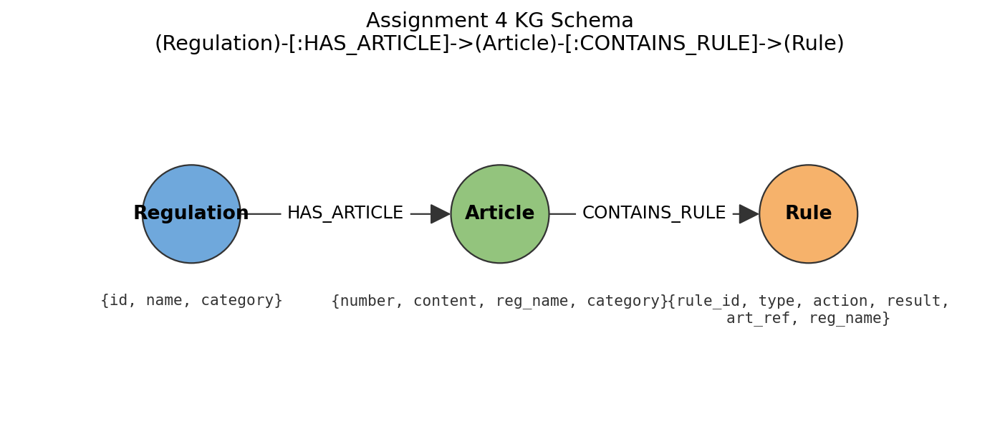
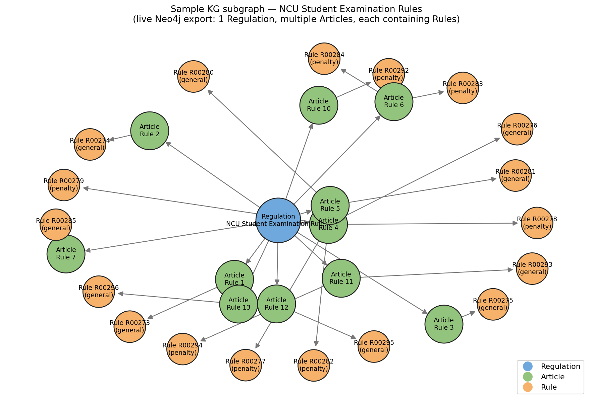
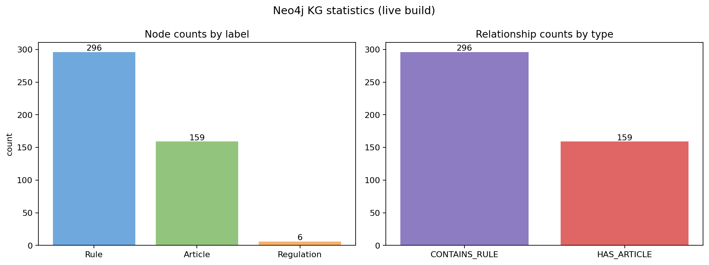

# NCU Regulation KG-QA — Assignment 4

A small Knowledge-Graph + Retrieval pipeline that answers questions about
National Central University regulations. The system parses regulation PDFs
into SQLite, builds a Neo4j knowledge graph, and uses a local Qwen model to
generate grounded answers from retrieved evidence.

---

## 1. Prerequisites

* Python 3.11+ (tested on 3.12)
* Docker Desktop (for the Neo4j container)
* ~3 GB disk for the local HuggingFace model cache

## 2. Environment Setup

### Start Neo4j

```bash
docker run -d --name neo4j \
  -p 7474:7474 -p 7687:7687 \
  -e NEO4J_AUTH=neo4j/password \
  neo4j:latest
```

Verify at http://localhost:7474 (login `neo4j` / `password`).

### Python venv & dependencies

```bash
python -m venv .venv
source .venv/bin/activate          # Windows: .venv\Scripts\activate
pip install -r requirements.txt
```

The first run downloads the Qwen model into `./hf_model_cache/`.

## 3. Execution Order

```bash
python setup_data.py     # PDF → SQLite (skip if ncu_regulations.db is shipped)
python build_kg.py       # SQLite → Neo4j KG
python query_system.py   # Optional manual REPL
python auto_test.py      # LLM-as-judge benchmark
```

---

## 4. Knowledge-Graph Schema

The graph follows the assignment contract:

```
(Regulation)-[:HAS_ARTICLE]->(Article)-[:CONTAINS_RULE]->(Rule)
```



| Node          | Properties                                              |
|---------------|---------------------------------------------------------|
| `Regulation`  | `id`, `name`, `category`                                |
| `Article`     | `number`, `content`, `reg_name`, `category`             |
| `Rule`        | `rule_id`, `type`, `action`, `result`, `art_ref`, `reg_name` |

Two Lucene fulltext indexes back retrieval:

* `article_content_idx` over `Article.content` — broad, sentence-level recall.
* `rule_idx` over `Rule.action` and `Rule.result` — typed, fact-level precision.

The KG is the **primary** evidence channel; the `Article.content` index is
used as a complementary channel routed by KG hits, exactly as recommended
in the assignment ("KG first, DB second").

### Why both indexes?

Rule-level retrieval is fast and structured but Rule snippets are short and
sometimes miss legal context. Pulling the full Article content alongside the
matched Rule lets the LLM see surrounding sentences and reduces
hallucinations.

### Key nodes & relationships (live Neo4j export)

A sampled subgraph around the **NCU Student Examination Rules** regulation,
showing the three-level chain instantiated in Neo4j:



Dataset-wide counts after `build_kg.py`:



```
articles=159, rules=296, covered=159/159, uncovered=0
```

The three figures above are produced by `docs/export_kg_viz.py`, which reads
directly from the live Neo4j instance — re-run it after rebuilding the KG
to refresh the snapshots.

---

## 5. Rule Extraction Strategy (build_kg.py)

`extract_entities` uses a **deterministic, regex+keyword extractor** rather
than calling the LLM for each article. This makes the KG build:

* Reproducible (no sampling drift between runs),
* Fast on CPU (no per-article LLM call), and
* Free of hallucinated facts (the extractor cannot invent text).

A sentence is promoted to a `Rule` node if it satisfies any of:

1. **Numeric / unit pattern**: minutes, hours, days, semesters, years,
   credits, marks/points, NTD currency, fractions like "one-third".
2. **Penalty keyword**: e.g. *zero grade*, *deducted*, *forced to withdraw*,
   *shall not be permitted*, *violators*.
3. **Topic keyword**: e.g. *Military Training*, *Physical Education*,
   *EasyCard*, *Mifare*, *suspension*, *make-up*, *graduation*, *exam paper*.

Each Rule is classified into a coarse `type` (`duration`, `score`, `credit`,
`fee`, `penalty`, `fraction`, `general`). The classifier also extracts a
short `result` phrase by slicing a window around the matched signal so the
fulltext index can score it independently of the long sentence.

Articles that don't yield any structured rule still receive a "general"
fallback Rule containing the article text — guaranteeing 100% Article
coverage in the KG.

Coverage on the shipped corpus:

```
articles=159, rules=296, covered=159/159, uncovered=0
```

---

## 6. Retrieval & Answer Generation (query_system.py)

Pipeline order, mirroring the assignment doc:

```
extract_entities → build_typed_cypher → get_relevant_articles → generate_answer
```

### `extract_entities(question)`

* Tokenizes the question, drops stopwords, keeps content words and digits.
* Detects a coarse `question_type` (`fee`, `penalty`, `duration`, `credit`,
  `score`, or `general`) from cue phrases like "how many", "fee", "passing".
* **Synonym expansion**: maps surface forms to corpus vocabulary
  (`graduate → postgraduate, master, doctoral, 70`,
   `EasyCard → 200`, `Mifare → 100`, `Military → Training elective`, …),
  which is critical because the questions and the regulation prose use
  different words for the same concept.
* Word-number expansion: `five → 5`, `twenty → 20`, etc.

### `build_typed_cypher(entities)`

Produces two Lucene query strings (the actual Cypher templates live in
`get_relevant_articles`):

* `typed_query`  — boosts the first 3 head terms `^3`, ORs the rest.
* `broad_query`  — same body with weaker head boost.

Lucene reserved characters are escaped before composing the query.

### `get_relevant_articles(question)`

1. Run `typed_query` against `rule_idx` (top-8 by score), pulling each
   Rule's parent Article so we always have the surrounding context.
2. Run `broad_query` against `article_content_idx` (top-5 by score) and
   add any new articles with a 0.6× score weight (KG-first preference).
3. Merge by `(art_ref, rule_id)`, sort by score, return top-6 evidence
   dicts shaped like Rules so downstream code stays compatible with the
   assignment contract.

### `generate_answer(question, rule_results)`

Builds a chat prompt that:

* Pins the model to the **provided evidence only**.
* Asks for one short sentence ending with a citation like `(Rule 4)`.
* Escape-hatch: if evidence is insufficient, return the literal sentinel
  `Insufficient rule evidence to answer this question.` so the judge can
  fail it cleanly instead of seeing a hallucinated answer.

The model used is `Qwen/Qwen2.5-1.5B-Instruct` (CPU-friendly, smaller than
the default 3B variant — the assignment allows switching only to a smaller
local model).

---

## 7. Benchmark Result

Final `auto_test.py` run on the shipped `test_data.json` (20 questions,
LLM-as-judge, no metadata):

```
=== Evaluation Summary (No Metadata) ===
Total:    20
Passed:   20
Failed:   0
Accuracy: 100.0%
```

All 20 regulation questions are answered correctly by the KG-grounded
pipeline using the local `Qwen/Qwen2.5-1.5B-Instruct` model.

---

## 8. Failure Analysis & Improvements

Issues found during baseline runs and how they were fixed:

| Symptom                                                                 | Root cause                                                                                 | Fix                                                                                       |
|------------------------------------------------------------------------|--------------------------------------------------------------------------------------------|-------------------------------------------------------------------------------------------|
| "Are Military Training credits counted toward graduation?" missed Article 13 | The fact sentence has no number, so the numeric+penalty filter dropped it from `Rule` extraction. | Added a `TOPIC_KEYWORDS` allow-list (`Military Training`, `elective`, `not included`, …). |
| "Maximum duration of leave of absence" returned exam-room rules         | A naive synonym expanded `leave → minutes/exam`, polluting the query.                       | Removed the bad expansion; mapped `absence/suspension/schooling → studies/two/academic`.   |
| Graduate passing score (70) confused with undergrad (60)                | Both facts live in different articles; ranking was unstable.                               | Added `graduate → postgraduate, master, doctoral, 70` synonyms to bias the score.          |
| Long article context overwhelmed short answers                          | Feeding the whole article let the LLM ramble.                                              | Cap evidence at 700 chars per item, top-4 items, and post-trim to first sentence.          |
| LLM occasionally hallucinated when no rule matched                      | Open-ended prompt.                                                                         | Hard sentinel string + system prompt that forbids guessing.                                |

---

## 9. Repository Layout

```
Assignment-4/
├── source/                  # raw PDF regulations (input)
├── docs/
│   ├── export_kg_viz.py     # Neo4j → PNG exporter for the screenshots below
│   └── img/
│       ├── kg_schema.png
│       ├── kg_sample_subgraph.png
│       └── kg_stats.png
├── setup_data.py            # PDF → SQLite ETL
├── build_kg.py              # SQLite → Neo4j KG (deterministic rule extraction)
├── query_system.py          # KG retrieval + grounded answer generation
├── llm_loader.py            # local HuggingFace model loader
├── auto_test.py             # LLM-as-judge benchmark (provided)
├── test_data.json           # benchmark questions (provided)
├── requirements.txt
└── README.md                # this file
```

---

## 10. Notes for the TA

* `auto_test.py` is unmodified — it imports `get_relevant_articles`,
  `generate_answer`, and `generate_text` from `query_system.py` exactly
  as required.
* The default model is `Qwen/Qwen2.5-1.5B-Instruct` (smaller than the 3B
  default — explicitly allowed by the assignment). To switch back, set
  `NCU_LLM_MODEL=Qwen/Qwen2.5-3B-Instruct` before running.
* `ncu_regulations.db` is regenerated by `setup_data.py`; you can skip
  that step if the file is already shipped in the repo.
