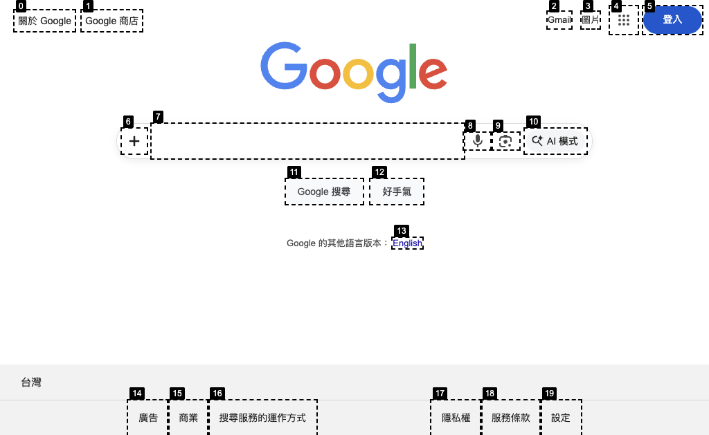
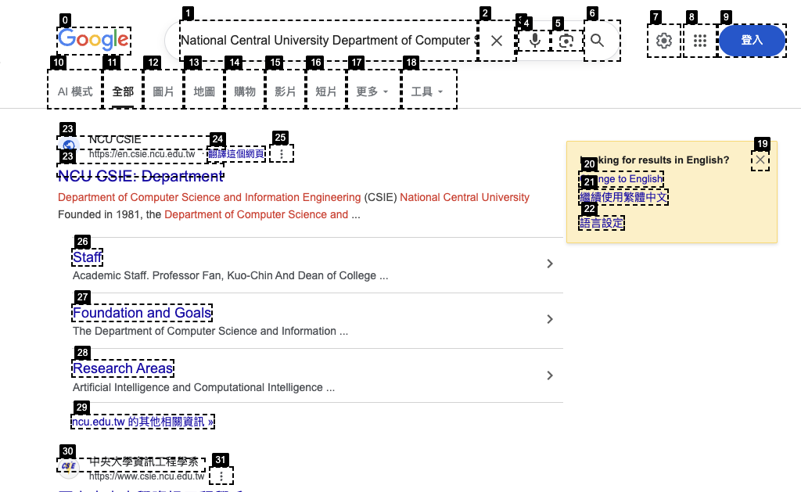
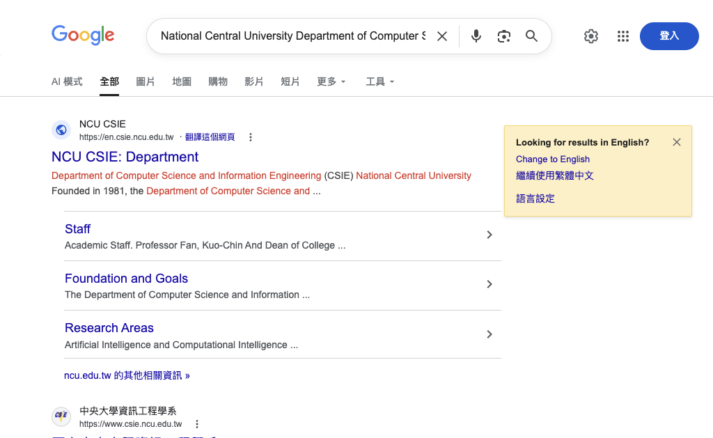

# Activity: Browser Use - Report

**學生**: 黃致霖 (114552005)
**課程**: Agentic AI
**日期**: 2026-03-31

---

## I. Implementation Overview

### Tool Selected

- **框架**: [PagePilot](https://github.com/jason79461385/PagePilot) (ICWSM 2026)
- **修改**: 以 **Claude Sonnet 4**（透過 [litellm](https://github.com/BerriAI/litellm)）取代原本的 OpenAI GPT-4o
- **瀏覽器自動化**: Selenium WebDriver + Chrome 146
- **Python**: 3.12.12

PagePilot 是一個多模態網頁自動化 AI Agent 框架，結合截圖視覺分析（標註互動元素）與 DOM 元素文字資訊，在 WebVoyager 基準測試上達到 76% 的任務完成率。

### Task Description

測試了三個不同複雜度的網站：

1. **Google Search** — 搜尋「NCU CSIE」並找到系網 URL
2. **Booking.com** — 搜尋東京飯店、選日期、依價格排序
3. **Ticketmaster** — 搜尋紐約演唱會活動

### Execution Result

#### Task A: Google Search — 成功

3 次迭代完成，約 27 秒。

| 迭代 | 動作 | LLM 耗時 | 說明 |
|------|------|---------|------|
| 1 | Type [7] | 3.0s | 找到搜尋框，輸入查詢 |
| 2 | Click [22] | 4.4s | 從搜尋結果點擊 NCU CSIE 連結 |
| 3 | ANSWER | 4.2s | 回答 `https://en.csie.ncu.edu.tw` |

*迭代 1 — Google 首頁標註了 20 個互動元素，Agent 正確辨識出搜尋框 [7]*

*迭代 2 — Agent 從搜尋結果中找到 NCU CSIE 連結並點擊*

*迭代 3 — 成功導航至資工系網站，確認正確後回答*

#### Task B: Booking.com — 部分成功

10 次迭代完成搜尋流程，但因達到迭代上限未能回答。

| 迭代 | 動作 | 說明 |
|------|------|------|
| 1 | Click [0] | 關閉 Genius 登入彈窗 |
| 2 | Type [14] | 輸入「Tokyo, Japan」 |
| 3-5 | Click | 操作日曆選擇 5/1 入住、5/3 退房 |
| 6 | Click [98] | 按下「Search」按鈕 |
| 7-8 | Click | 選擇「Price (lowest first)」排序 |
| 9-10 | Scroll | 找到最低價飯店 TWD 2,390，但迭代耗盡 |

Agent 成功處理了彈窗、日曆日期選取、排序等複雜 UI，**未觸發 CAPTCHA**。

#### Task C: Ticketmaster — 失敗

Agent 陷入迴圈，無法完成任務。

| 迭代 | 動作 | 說明 |
|------|------|------|
| 1 | Click [20] | 接受 Cookie 同意彈窗 |
| 2-9 | Type/Click [15] | **反覆嘗試在地點欄位輸入「New York」，文字始終未寫入** |
| 10 | Click [9] | 嘗試換策略但迭代已用完 |

Ticketmaster 的地點欄位使用 React controlled component，Selenium 的 `send_keys()` 無法觸發 React 的 state 更新，導致輸入被靜默忽略。

---

## II. Current Limitations of AI Browsers

### Latency

| 指標 | Google | Booking.com | Ticketmaster |
|------|--------|-------------|-------------|
| 平均 LLM 呼叫 | 3.6s | 4.1s | 4.0s |
| 平均每次迭代 | 9.0s | 8.2s | 8.5s |
| 總耗時 | 27s | 122s | 125s |
| 人類估計 | ~10s | ~45s | ~20s |

- LLM 推理約 4 秒，但瀏覽器等待時間（每次動作 3-10 秒）才是主要瓶頸
- Type 動作按下 Enter 後固定等待 10 秒，對 Google 等快速頁面過於保守
- 整體約比人類慢 **2.7 倍**

### Context Window

- PagePilot 使用訊息裁切策略（`clip_message_and_obs`），僅保留最近 N 張截圖，舊截圖以文字摘要取代
- 3-4 次迭代的 Google 任務中 context 充足（每次約 3,500 tokens）
- 每張 1024x768 截圖約消耗 1,500-2,000 tokens，長任務（15+ 迭代）可能導致 Agent 遺忘早期步驟

### DOM Perception

- Google 的簡單 DOM：元素標註正確，辨識 20 個互動元素無誤
- Booking.com 的複雜 UI：成功標註 100+ 元素，正確操作日曆選取器
- **Ticketmaster 完全失敗**：React controlled component 的 input 欄位不回應 Selenium `send_keys()`，Agent 無法察覺輸入被靜默忽略
- 已知限制：面積 < 20px² 的元素會被過濾、Shadow DOM 無法偵測、`<iframe>` 內容無法進入

### Reliability

- **格式幻覺**：Agent 偶爾省略 `Action:` 前綴（如直接寫 `ANSWER;`），需多一次迭代自我修正
- **無元素幻覺**：三個網站中 Agent 從未引用不存在的元素編號
- **動作迴圈**：Ticketmaster 測試中 Agent 連續 5 次重複相同的 Click → Type 操作，無法辨識動作已靜默失敗
- **穩定性差異極大**：Google（簡單 DOM）近乎完美 → Booking.com（標準 HTML）表現優秀 → Ticketmaster（React SPA）完全失敗

---

## III. Challenges Encountered

### Environment Setup

1. **Python 版本**：系統為 Python 3.14，部分套件不相容，改用 `uv venv --python 3.12` 建立 3.12 環境
2. **API Key 改裝**：PagePilot 僅支援 OpenAI API，透過 litellm 改用 `anthropic/claude-sonnet-4-6` 模型，修改幅度小
3. **ChromeDriver**：Selenium 4.28 內建驅動管理器，自動下載對應 Chrome 146 的 ChromeDriver
4. **Playwright + Selenium 並存**：PagePilot 同時依賴兩者，需額外執行 `playwright install chromium`

### Cost

| 網站 | Prompt Tokens | Completion Tokens | 迭代次數 | 花費 |
|------|--------------|-------------------|---------|------|
| Google | 8,753 | 287 | 3 | **$0.031** |
| Booking.com | 45,821 | 1,035 | 10 | **$0.153** |
| Ticketmaster | 33,780 | 643 | 10 | **$0.111** |

- 每張截圖約 1,500-2,000 tokens，花費隨迭代次數線性增長
- Ticketmaster 花了 $0.111 在完全失敗的任務上 — 10 次無效重試的代價

### Security & CAPTCHA

- **三個網站均未觸發 CAPTCHA**
- 使用 `disable-blink-features=AutomationControlled` 隱藏 Selenium 自動化標記
- Booking.com 和 Ticketmaster 的 Cookie/登入彈窗均被 Agent 成功關閉
- **Ticketmaster 的隱式防禦**：雖未部署 CAPTCHA，但 React controlled component 本身就構成有效的 anti-bot 機制 — Selenium 注入的按鍵被 React 虛擬 DOM 靜默忽略
- 更強的反爬措施（Cloudflare Turnstile、reCAPTCHA v3）未遇到，但預期會完全阻擋 Agent
